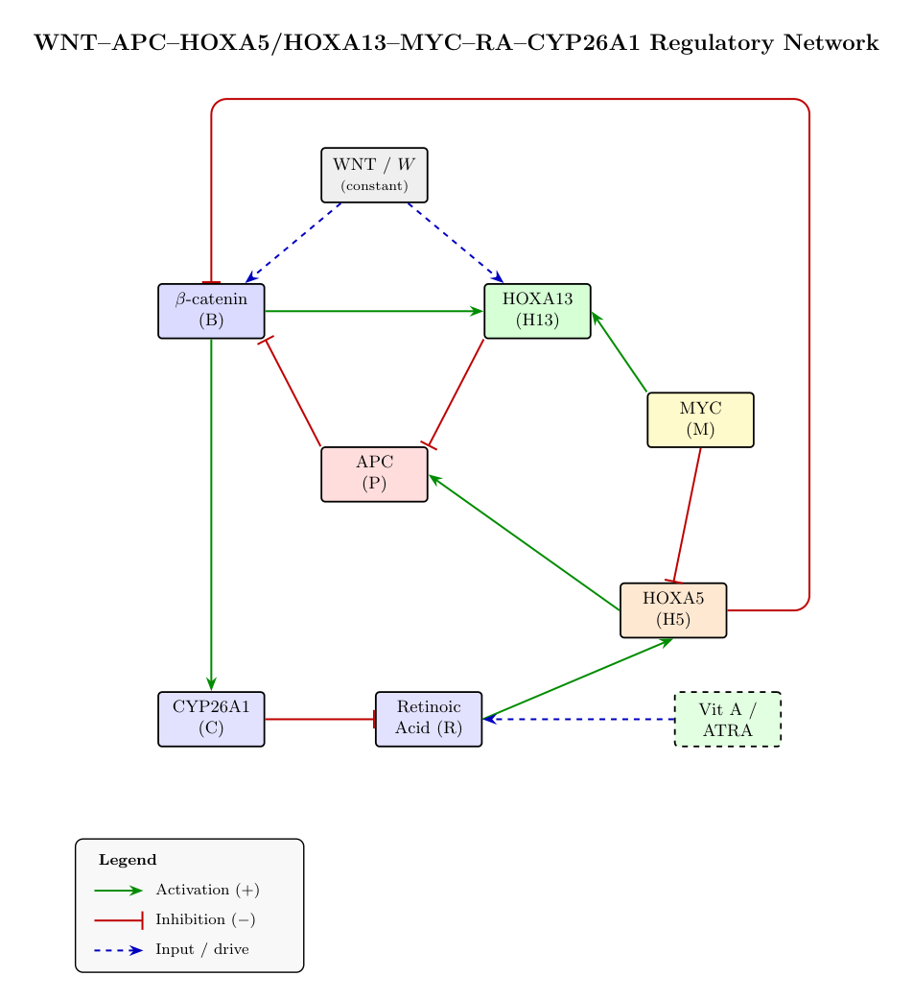

# Physics-Informed Neural Networks for a WNT–RA–HOX Cancer-Signaling Model

We use **Physics-Informed Neural Networks (PINNs)** to solve the forward and
inverse problems of a reduced gene-regulatory network that governs the
WNT / retinoic-acid (RA) / HOX axis in colorectal-cancer signaling — and we
push on the harder, more honest question underneath it: *given noisy trajectory
data, which of the model's biological parameters can we actually recover, and
which are fundamentally non-identifiable?*



---

## The problem we're studying

The biology reduces to a **7-state ODE system** — β-catenin, APC, HOXA5,
HOXA13, MYC, retinoic acid, and CYP26A1 — driven by circadian RA forcing and a
smooth ATRA pulse, with WNT drive `W` and APC functionality `θP` as the two
knobs that separate four clinical regimes:

| Regime | Meaning |
|--------|---------|
| **Normal** | healthy tissue, low WNT |
| **Early Adenoma** | early lesion |
| **Advanced Adenoma** | elevated WNT |
| **Severe APC Loss** | saturated WNT, loss of APC control |

The system has **36 kinetic parameters**. Recovering them from a handful of
trajectories is a classically ill-posed inverse problem (condition number
≈ 10⁶), so most of our work is about *measuring* and *beating* that ceiling
rather than pretending it isn't there.

---

## What we built

**Forward PINN.** A Fourier-feature MLP (width 256 × depth 4, GELU) that solves
the ODE system directly. The fast circadian + pulse modes cause spectral bias
in a plain MLP ("everything collapses to lines"), so we use a multi-scale
Fourier time embedding to represent them. We validate against a stiff
`solve_ivp` Radau reference (`rtol=1e-10`, `atol=1e-12`).

**Inverse PINN.** We recover the 36 parameters from trajectory data, scaling
from a 2-parameter proof of concept up to the full set, across all four regimes
and multiple experimental conditions.

**Identifiability analysis.** We don't just report point estimates — we quantify
how trustworthy each recovered parameter is, using three independent lenses
(sensitivity, Fisher information, and profile likelihood) that agree with one
another.

---

## Headline results

**1 — More information beats a better network.** We tested two levers for
raising the recovery count. Shrinking and regularizing the network did nothing
(the architecture is *not* the bottleneck). But adding **parameter-exciting
conditions** — exogenous pulses that directly perturb the WNT and MYC nodes and
light up the "dark" half of the network — lifted the classical ODE-fit recovery
from a **18/17/13/13** baseline to **24/23/21/14** parameters under 10 % error
(Normal / Early Adenoma / Advanced Adenoma / Severe APC Loss).

**2 — The PINN's autodiff-derivative ceiling is breakable.** The inverse PINN
had a lower ceiling (~8/36) than the classical ODE-fit, which we traced to a
biased autodiff `dz/dt` residual. Replacing it with a **derivative-free integral
(trapezoidal) residual** lifted the *PINN itself* from a **10/4/5/7** baseline
to **17/16/10/7** — roughly doubling the recovered count (+24 total) without
falling back to the ODE-fit.

**3 — A structural wall we can see from three directions.** In high-WNT regimes,
β-catenin saturates and `θP` (APC functionality) becomes non-identifiable. We
confirmed this is *practical / conditioning* non-identifiability — not a bug —
independently via:

- a **Fisher Information Matrix** (one hard-null direction per regime; the count
  of near-perfectly-correlated parameter pairs climbs 0 → 2 → 7 → 10 with WNT
  drive; cond(FIM) ≈ 10⁷–10¹⁷), and
- **Raue-style profile-likelihood** identifiability (95 % CIs → IDENT / WEAK /
  NON-IDENT).

As a clean contrast, restricting the problem to the **8 most-identifiable
parameters** gives a well-posed system — cond(FIM) ≈ 10²–10³, zero null
directions, all eight IDENT — showing precisely where the recoverable
information lives.

**4 — In a hybrid model, what breaks is the data, not the architecture.** In a
hybrid / universal-differential-equation (UDE) model we hand one regulatory
relationship to a small neural network and keep the rest mechanistic. The
network is built with `f(0) = 0` — no regulator means no activation — and that
constraint is meant to stop it absorbing a constant out of the equation's
basal-production parameter. It doesn't. We tried five ways of imposing it,
including the monotone-and-bounded construction the UDE literature recommends;
all five leave the basal parameter **14–203 %** off.

The reason is that **no regulator in this model ever gets near zero** under any
of our conditions, so `f(0) = 0` is a constraint asserted where no data live.
Adding two *depletion* protocols — a WNT knockdown and a retinoid-free diet —
puts the anchor inside the observed range, and the same hybrid with the same
seeds and budget improves by up to two orders of magnitude:

| learned edge | functional error | basal-parameter error | equation parameters |
|--------------|------------------|-----------------------|---------------------|
| RA → HOXA5 | 12.8 % → **0.4 %** | 25.3 % → **0.4 %** | 3/8 → **8/8** |
| RA → CYP26A1 | 1.0 % → **0.1 %** | 15.6 % → **0.7 %** | 6/8 → **8/8** |
| β-catenin → MYC | 7.6 % → **0.5 %** | 49.0 % → **2.7 %** | 2/4 → **4/4** |

The gain tracks *how completely* the regulator reaches zero: retinoic acid gets
there exactly, β-catenin only to 0.013 because a feedback arm keeps producing
it. A control arm adding the same number of extra experiments **without**
reaching any anchor changes nothing (4.0 → 4.2 %), so the effect is
anchor-visiting rather than extra data.

Two further findings come from screening all **13** regulatory edges instead of
three hand-picked ones. Edges where the network *multiplies* a state rather
than adding to it have no constant to absorb, and recover **every** surviving
parameter at 0.0–4.5 % with no special conditions. And in the highest-WNT
regime, where the mechanistic fit is itself badly conditioned, the hybrid can
*beat* it — so "the neural component always hurts identifiability" is not
unconditional.

---

## Repository map

| Folder | What it is |
|--------|-----------|
| `PINN-smaller/forward_pinn_train/` | Forward PINN — supervised interpolation baseline |
| `PINN-smaller/forward-pinn-train-hybrid/` | Forward PINN — honest sparse-data solve (40 obs + IC + physics) |
| `PINN-inverse-solve/` | First inverse PINN, 2 → 36 parameters, single condition |
| `PINN-inverse-better/` | Multi-condition + log-parameterization + adaptive weighting |
| `PINN-inverse-multicond/` | 6 conditions + the classical ODE-fit recovery (`recover_odefit.py`) |
| `PINN-inverse-multicond-excite/` | The **information lever** — WNT/MYC-exciting conditions |
| `PINN-inverse-pinn-boost/` | The **integral-residual** PINN that breaks the derivative-bias ceiling |
| `PINN-fisher-matrix/` | Full 36-parameter Fisher-information identifiability analysis |
| `PINN-fisher-matrix-top8/` | Reduced 8-parameter well-posed contrast |
| `PINN-bayesian/` | **Bayesian inverse** PINN — HMC over the parameters with the state nets frozen → posterior marginals |
| `PINN-forward-bayesian/` | **Bayesian forward** PINN — HMC over the network weights → posterior-predictive trajectory band |
| `PINN-hybrid-ude/` | **Neural-mechanistic hybrids (UDEs)** — 13 learnable regulatory edges, 5 constraint parameterisations, the equation-local edge screen, and the anchor-visiting experiment |
| `network-diagram/` | The regulatory-network schematic (TikZ source + PDF) |

---

## Reproducing our runs

Each experiment folder ships a `run.sh` that timestamps a `runs/<...>/`
directory, sets `PYTHONPATH`, and streams a training log:

```bash
cd PINN-inverse-pinn-boost
bash run.sh            # writes runs/<timestamp>/train.log
```

The Fisher-matrix analyses run on CPU (`solve_ivp` sensitivities); the PINN
training uses CUDA if available.

The hybrid folder also offers a much cheaper instrument. `run_hybrid.sh` trains
the full four-regime model per variant (~2 GPU-hours), but `screen_terms.py`
fits one equation at a time against reference trajectories, which is fast
enough to sweep every edge and every constraint:

```bash
cd PINN-hybrid-ude
python3 anchor_report.py                        # pre-flight: is each f(0)=0 anchor observed?
python3 screen_terms.py --out runs/screen \
        --terms all --params gated,sc           # the edge atlas
bash run_hybrid.sh bm_myc__sc 3                 # one edge, full pipeline, 3 restarts
bash run_queue_depletion.sh                     # the anchor-visiting arm
```

---

## Tech stack

**PyTorch** (PINN models, autodiff residuals, CUDA training) · **SciPy /
NumPy** (stiff ODE reference, classical ODE-fit) · **lmfit** &
**`identifiability`** (profile-likelihood CIs) · **SALib** (sensitivity) ·
**Matplotlib** (diagnostics) · **TikZ** (the network schematic).

A pinned environment is in [`requirements-lock.txt`](requirements-lock.txt).

---

*This repository documents an active research effort: forward and inverse PINN
solvers, a systematic study of what makes biological parameters recoverable, and
a rigorous, multi-method identifiability verdict on a real cancer-signaling
model.*
