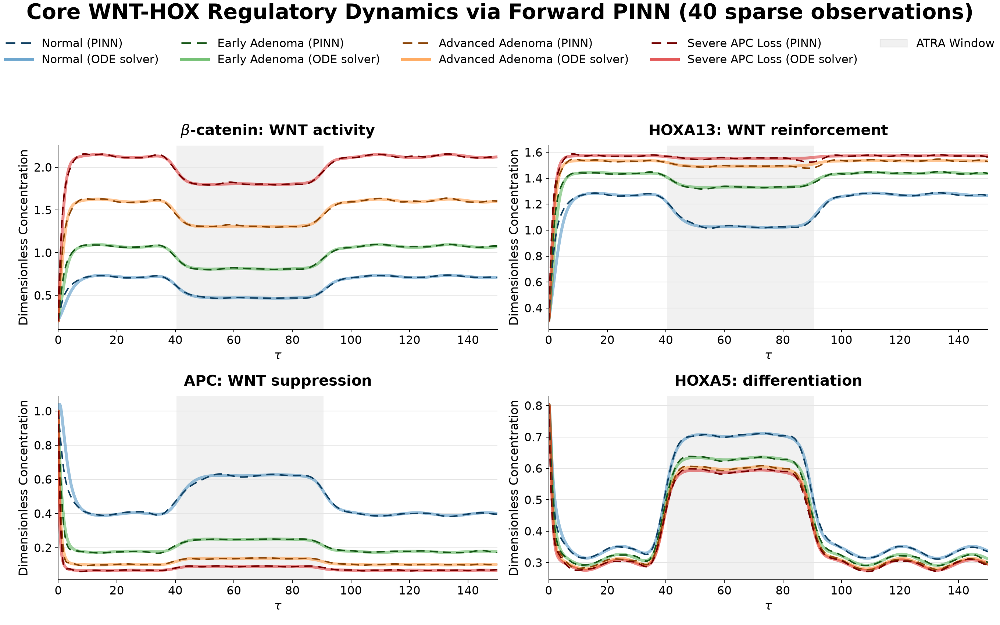
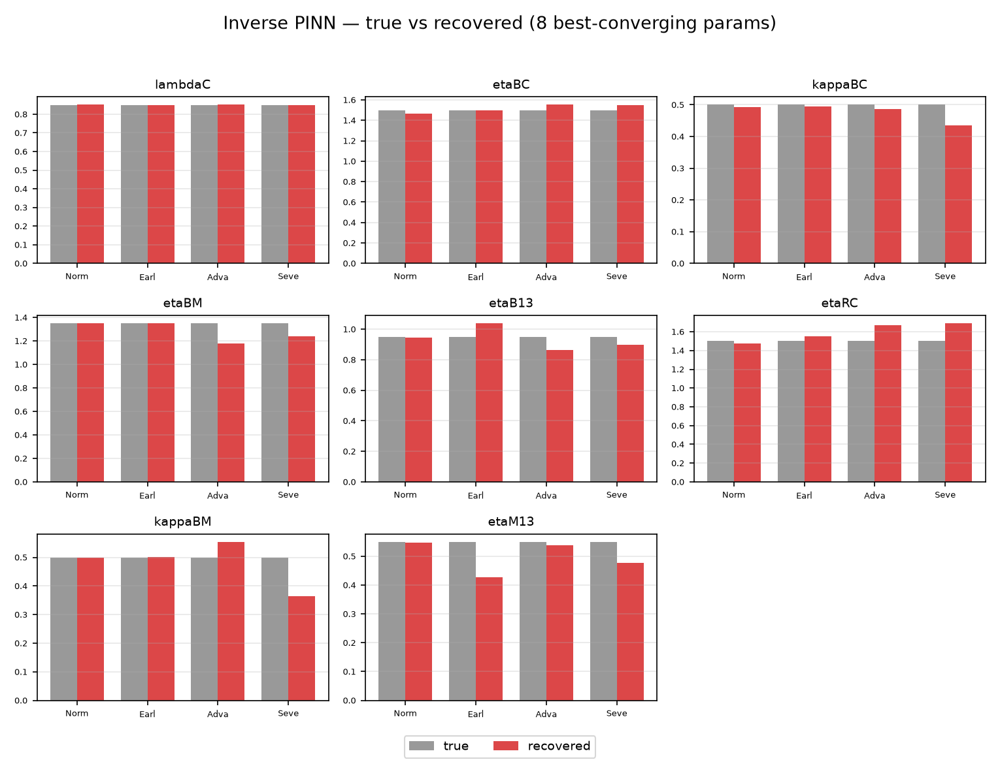
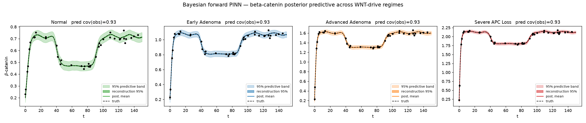
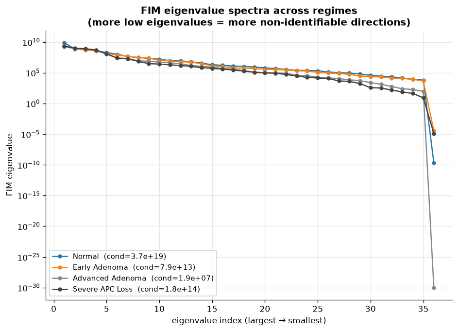
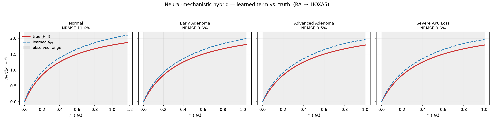
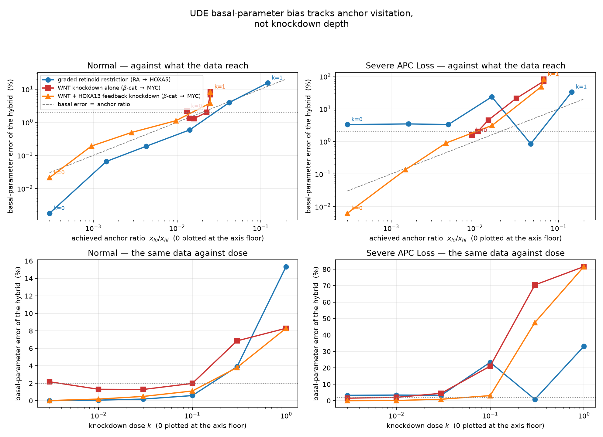

# Physics-Informed Neural Networks for a Cancer-Signaling Model

**Scientific machine learning applied to colorectal-cancer biology: solving a
7-equation gene-regulatory ODE system with neural networks, recovering its
biological parameters from sparse noisy data, and proving — with three
independent methods — exactly which parameters are and are not recoverable.**


---

## At a glance

| | |
|---|---|
| **Domain** | Systems biology — the WNT / retinoic-acid / HOX signaling axis in colorectal cancer |
| **Model** | 7 coupled nonlinear ODEs, 36 kinetic parameters, 4 disease regimes (Normal → Severe APC Loss) |
| **Methods** | Physics-informed neural networks (forward + inverse), Bayesian PINNs with HMC, Fisher-information & profile-likelihood identifiability, global sensitivity analysis, neural-mechanistic hybrids (UDEs) |
| **Stack** | PyTorch · SciPy · NumPy · SALib · lmfit · Matplotlib · LaTeX/TikZ · CUDA |
| **Scale** | 15 experiment folders, hundreds of GPU training runs, a 49-page write-up with 47 references |
| **Key result** | Parameter recovery raised from **10/36 → 24/36** by diagnosing *why* the network fails, not by making it bigger |

---

## What the project is about

Cancer models are written as differential equations with dozens of rate
constants nobody can measure directly. The question this project answers is:
**can a neural network trained on a handful of noisy measurements tell us what
those constants are — and can it tell us honestly when it can't?**

The biology reduces to a **7-state system** — β-catenin, APC, HOXA5, HOXA13,
MYC, retinoic acid and CYP26A1 — driven by a circadian retinoic-acid rhythm and
a drug (ATRA) pulse. Two knobs, WNT drive `W` and APC functionality `θP`,
separate four clinical regimes from healthy tissue to severe APC loss.
Recovering all 36 parameters from trajectories is a classically ill-posed
inverse problem (condition number ≈ 10⁶), so the work is as much about
*measuring* the ceiling as about pushing it.

---

## 1 · Forward problem — a neural network that solves the ODEs

A Fourier-feature MLP is trained on **only 40 random observations** plus the
physics residual and must fill in the rest of the trajectory itself. A plain MLP
cannot represent the fast circadian and pulse modes (spectral bias — every
curve collapses to a line); a multi-scale Fourier time embedding fixes it. The
network is validated against a stiff `solve_ivp` Radau reference
(`rtol = 1e-10`).



*Dashed = PINN, solid = reference solver, in all four disease regimes. Grey
band = ATRA treatment window.*

---

## 2 · Inverse problem — recovering the 36 biological parameters

The inverse PINN learns the trajectories and the parameters jointly. Scaling
from a 2-parameter proof of concept to the full set exposed a **hard ceiling of
~8/36** parameters recovered to within 10 %. Rather than tune blindly, I traced
the ceiling to two separate causes and fixed each:

| Lever | What was tried | Result (params under 10 % error, Normal / Early / Advanced / Severe) |
|---|---|---|
| Bigger / smaller / regularised networks | architecture sweep | **no change** (9/10/2/4) — architecture is not the bottleneck |
| **Derivative-free residual** | replace the biased autodiff `dz/dt` with a trapezoidal integral residual | **10/4/5/7 → 17/16/10/7** (+24 total, ≈2×) |
| **More informative experiments** | add conditions that perturb the WNT and MYC nodes directly | classical ODE-fit **18/17/13/13 → 24/23/21/14** |



*The eight best-recovered parameters across the four regimes; grey = truth,
red = recovered.*

---

## 3 · Uncertainty — Bayesian PINNs with Hamiltonian Monte Carlo

Point estimates hide how confident the model should be. Two Bayesian variants
replace them with posteriors:

- **Bayesian forward PINN** — HMC over the network *weights* gives a calibrated
  95 % predictive band around every trajectory (empirical coverage 0.93–0.97).
- **Bayesian inverse PINN** — HMC over the 36 *parameters* gives a marginal per
  parameter; a wide or prior-shaped marginal is an honest "not identifiable"
  verdict rather than a confidently wrong number.



---

## 4 · Identifiability — knowing what can't be known

In high-WNT regimes β-catenin saturates and `θP` (APC functionality) stops
influencing the data, so no method can recover it. I confirmed this from three
independent directions rather than blaming the optimiser:

- **Fisher Information Matrix** — one hard-null direction per regime; the
  number of near-perfectly-correlated parameter pairs climbs 0 → 2 → 7 → 10 as
  WNT drive rises.
- **Profile likelihood** (Raue-style 95 % CIs → IDENT / WEAK / NON-IDENT).
- **Bayesian posteriors** — the same parameters come back wide.

Restricting to the **8 most-identifiable parameters** turns the problem
well-posed (cond ≈ 10²–10³, zero null directions) — a clean demonstration of
*where* the recoverable information lives.



---

## 5 · Neural-mechanistic hybrids — where the data fail, not the network

In a universal-differential-equation (UDE) setup one regulatory relationship is
handed to a small neural network while the rest stays mechanistic. The standard
`f(0) = 0` constraint is supposed to stop the network from absorbing a constant
out of the equation; **five different ways of imposing it all failed** (basal
parameter 14–203 % off).

The diagnosis: no regulator in the model ever approaches zero under normal
conditions, so the constraint is asserted where there is no data. Designing two
*depletion* experiments (a WNT knockdown and a retinoid-free protocol) that
actually visit the anchor fixed it — same seeds, same budget:

| learned edge | functional error | basal-parameter error | equation params recovered |
|---|---|---|---|
| RA → HOXA5 | 12.8 % → **0.4 %** | 25.3 % → **0.4 %** | 3/8 → **8/8** |
| RA → CYP26A1 | 1.0 % → **0.1 %** | 15.6 % → **0.7 %** | 6/8 → **8/8** |
| β-catenin → MYC | 7.6 % → **0.5 %** | 49.0 % → **2.7 %** | 2/4 → **4/4** |

A control arm adding the same number of extra experiments *without* reaching
the anchor changed nothing (4.0 → 4.2 %), a dose-response with the condition
count held fixed showed the error tracks *how close the data get to zero*, and
a training-free design table then **predicted the right protocol for edges it
had never seen** (95.6 % → 0.0 % error).





---

## Skills demonstrated

- **Scientific ML** — PINNs, universal differential equations, Fourier-feature
  networks, spectral-bias diagnosis, custom residual formulations, multi-start
  and two-stage (Adam → L-BFGS) optimisation.
- **Bayesian inference** — Hamiltonian Monte Carlo over network weights and
  over physical parameters, calibration and coverage checks, ESS diagnostics.
- **Inverse problems & identifiability** — Fisher information, profile
  likelihood, Morris / Sobol global sensitivity, ill-posedness analysis.
- **Experimental design** — pre-registered predictions, information-matched
  control arms, dose-response with confounders held fixed, honest reporting of
  failed predictions.
- **Engineering** — reproducible timestamped runs, GPU training pipelines,
  multi-hour unattended experiment queues managed under tmux, LaTeX paper
  and presentation built from the repo's own outputs.

---

## Repository map

| Folder | What it is |
|---|---|
| `PINN-smaller/forward-pinn-train-hybrid/` | Forward PINN — sparse-data solve (40 obs + IC + physics) |
| `PINN-smaller/forward_pinn_train/` | Forward PINN — dense-label baseline |
| `PINN-inverse-solve/` → `-better/` → `-multicond/` | The inverse chain: 2 → 36 params, multi-condition, the classical ODE-fit |
| `PINN-inverse-multicond-excite/` | The **information lever** — WNT/MYC-exciting conditions |
| `PINN-inverse-pinn-boost/` | The **integral-residual** PINN that breaks the derivative-bias ceiling |
| `PINN-fisher-matrix/`, `-top8/` | Fisher-information identifiability (36-param and 8-param contrast) |
| `PINN-bayesian/`, `PINN-forward-bayesian/` | Bayesian inverse and forward PINNs (HMC) |
| `PINN-hybrid-ude/` | Neural-mechanistic hybrids — 13 learnable edges, edge screen, anchor-visiting experiments |
| `PINN/` | Original notebooks + `run_sa_7ode.py` sensitivity analysis (CSV tables in `sa_results/`) |
| `network-diagram/` | The regulatory-network schematic (TikZ) |
| `docs/figures/` | The figures used on this page |

---

## Running it

Every experiment folder ships a `run.sh` that creates a timestamped
`runs/<...>/` directory and streams a training log:

```bash
cd PINN-inverse-pinn-boost
bash run.sh                     # writes runs/<timestamp>/train.log
```

The hybrid folder also has a fast per-equation screen:

```bash
cd PINN-hybrid-ude
python3 anchor_report.py                                  # is each f(0)=0 anchor observed?
python3 screen_terms.py --out runs/screen --terms all     # the edge atlas
bash run_hybrid.sh bm_myc__sc 3                           # one edge, full pipeline, 3 restarts
```

Fisher-matrix analyses run on CPU; PINN training uses CUDA when available. A
pinned environment is in [`requirements-lock.txt`](requirements-lock.txt).

---

## Author

Amirkhan Aidarkhan — research project, May–August 2026. Questions and
collaboration welcome: <amirkhanaidarkhan06@gmail.com>.
